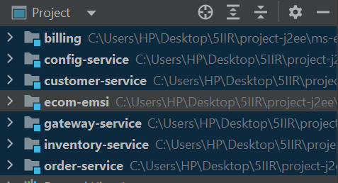
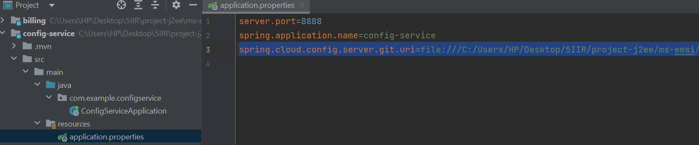
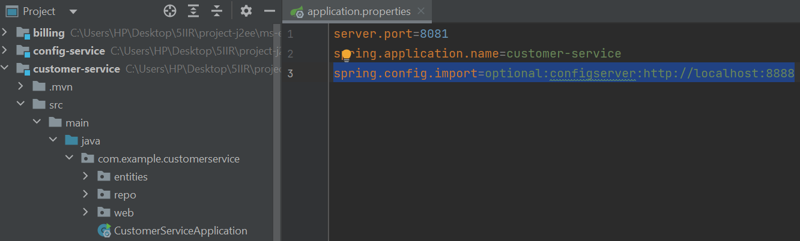
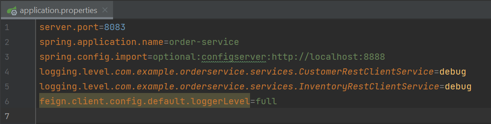

# ecom-microservices
<h3>Backend</h3>
<h2>Architecture technique</h2>
</img>
<h2>Les microservices utilisés</h2>
</img>
<h2>Config-service</h2>
</img>
<li>Config repo</li>
</img>
<h2>Customer-service</h2>
</img>
<h2>Order-service</h2>
</img>

