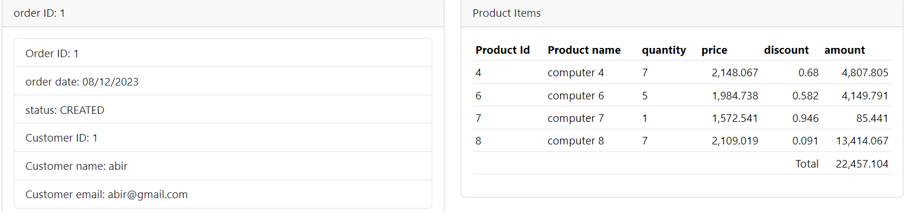

# ecom-microservices
<h3>Backend</h3>
<h2>Architecture technique</h2>
</img>
<h2>Les microservices utilisés</h2>
</img>
<h2>Config-service</h2>
</img>
<li>Config repo</li>
</img>
<h2>Customer-service</h2>
</img>
<h2>Order-service</h2>
</img>
<h2>Consul config</h2>
</img>
</img>
<h2>Vault</h2>
</img>
<h3>Frontend</h3>
<h2>Architecture :</h2>
</img>
<h2>Liste des produits :</h2>
</img>
<h2>Liste des clients :</h2>
</img>
<h2>Liste des commandes d'un client :</h2>
</img>
<h2>Liste des détails d'une commande :</h2>
</img>
